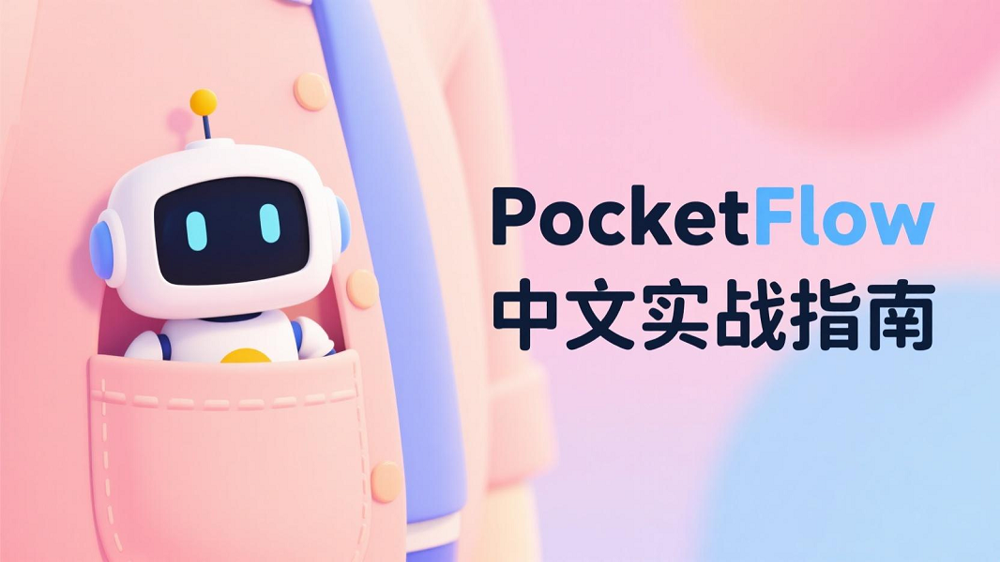

  

# 简介

[Pocket Flow](https://the-pocket.github.io/PocketFlow/) 是一个轻量级的**LLM**（大型语言模型）框架，它的核心只有约**100**行代码，与其他 LLM 框架如 [LangChain](https://smith.langchain.com/) 相比，是一个非常轻量级的框架。

PocketFlow 的核心理念是使用图 **Graph** 作为基本抽象，更加**精简**，通过这个简单的抽象可以实现各种复杂的 LLM 应用模式，如**Agent、工作流、RAG**等

PocketFlow强调代理编码 **Agentic Coding** 的开发范式，即"人类设计，Agent编码"的方式来构建LLM应用。

通过本教程，你应该能够快速上手使用 **PocketFlow**，逐步探索并实现你想要的更复杂的功能和应用场景。
# 章节大纲

## 基础教程(更新中)

- [x] [PocketFlow之**节点**(Node)-简易聊天机器人](./lesson/lesson1.md)
- [x] [PocketFlow之**结构化输出**(Structured Output)-提取简历数据](./lesson/lesson2.md)
- [x] [PocketFlow之**工作流**(Workflow)-自动化天气信息处理系统](./lesson/lesson3.md)
- [ ] [PocketFlow之**单智能体**(Agent)-旅行规划助手](./lesson/lesson4.md)
- [ ] [PocketFlow之**检索增强生成**(RAG)](./lesson/lesson5.md)
- [ ] [PocketFlow之**批处理**(Batch)](./lesson/lesson6.md)
- [ ] [PocketFlow之**流式处理**(Streaming)](./lesson/lesson7.md)

## 进阶教程(待更新)

- [ ] [PocketFlow之**Map-Reduce**模式](./lesson/lesson8.md)
- [ ] [PocketFlow之**多智能体**系统](./lesson/lesson9.md)
- [ ] [PocketFlow之**监督Agent**](./lesson/lesson10.md)
- [ ] [PocketFlow之**并行执行**](./lesson/lesson11.md)
- [ ] [PocketFlow之**思维链**](./lesson/lesson12.md)
- [ ] [PocketFlow之**记忆系统**](./lesson/lesson13.md)

## 前置

- [x] [环境安装与配置](./lesson/init-env.md)

## 学习交流群

> 有问题或者建议欢迎大家指正，感兴趣的小伙伴可以通过联系方式添加学习交流群

## 打赏

## 联系方式

