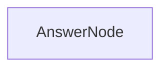

# PocketFlow之**节点**(Node)-简易聊天问答机器人


本小节，您将了解 PocketFlow 的两个核心概念，节点(Node)和流(Flow):

Node: 一个节点代表处理单元，包含三个主要方法:
- prep: 数据准备
- exec: 数据处理
- post: 处理结果

Flow: 流是连接多个节点的图结构，用于组织节点之间的执行逻辑， 

## 项目流程图



## 前置条件: [环境安装与配置](./init-env.md)

## 步骤1: 创建项目目录结构

```bash
# 进入虚拟环境
cd p3
# 创建项目目录 workspace
mkdir workspace
# 进入项目目录
cd workspace
# 新建目录
mkdir -p flows utils
# 创建项目文件
touch main.py flows/answerflow.py utils/call_llm.py

```


## 步骤2: 创建 LLM 调用函数

在 `call_llm.py` 中，添加以下代码:

```python
from openai import OpenAI  

def call_llm(prompt):
    client = OpenAI(
        base_url= 'https://api.deepseek.com',
        api_key="YOUR_API_KEY_HERE") # 替换为你的API密钥  
    res = client.chat.completions.create(
        model = "deepseek-chat",
        messages = [{
            "role": "user",
            "content": prompt
        }]
    )
    return res.choices[0].message.content
```

## 步骤3: 定义聊天问答节点

在 `answerflow.py` 中，添加以下代码:

```python
from pocketflow import Node,Flow
from utils.call_llm import call_llm

# 定义问答节点
class AnswerNode(Node):
    # 数据准备，从 shared 读取问题
    def prep(self, shared):
        return shared['question']

    # 执行回答，调用 LLM
    def exec(self, question):
        return call_llm(question)

    # 数据结果，将回答写入 shared
    def post(self, shared, prep_res, exec_res):
        shared['answer'] = exec_res

# 新建问答节点
answer_node = AnswerNode()
# 新建问答流程
answer_flow = Flow(start=answer_node)

```

## 步骤4: 创建主程序

在 `main.py` 中，添加以下代码:

```python
from flows.answerflow import answer_flow

def main():
    # 初始化数据
    shared = {
        "question":"用一句话概括，宇宙的尽头是什么？",
        "answer": None
    }

    # 运行问答流程
    answer_flow.run(shared)
    
    # 输出问题和回答
    print("Question:",shared['question'])
    print("Answer:",shared["answer"])

if __name__ == '__main__':
    main()
```

## 步骤5: 运行程序

```bash
python main.py
```


## 运行结果


## 下一课
[PocketFlow之**结构化输出**(Structured Output)-提取简历数据](./lesson2.md)