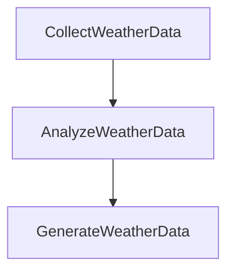

# PocketFlow之**工作流**(Workflow)-自动化天气信息处理系统

本小节，您将了解如何将复杂任务拆分为多个节点，并按顺序执行，形成一个完整的工作流

## 项目流程图



## 前置条件: [环境安装与配置](./init-env.md)

## 步骤1: 创建项目目录结构

```bash
# 进入虚拟环境
cd p3
# 进入项目目录
cd workspace
# 创建项目文件
touch main3.py flows/weatherFlow.py
```

## 步骤2: 定义收集天气节点


在 `weatherFlow.py` 中，添加以下代码:

```python
from pocketflow import Node,Flow
from utils.call_llm import call_llm

# 定义收集天气节点
class CollectWeatherData(Node):
    def prep(self,shared):
        return shared['city']
    def exec(self,city):
        prompt = f"模拟API请求：请提供{city}当前的天气信息，包括温度、湿度、风速和天气状况"
        res = call_llm(prompt)
        return res
    def post(self,shared,prep_res,exec_res):
        shared['weather_data'] = exec_res
        print("\n===== 已收集到的天气数据 =====\n") 
```

## 步骤3: 定义分析天气节点

在 `weatherFlow.py` 中，紧接着添加以下代码:

```python
# 定义分析天气节点
class AnalyzeWeatherData(Node):
    def prep(self,shared):
        return shared['weather_data']
    def exec(self,weather_data):
        prompt = f"""
        分析以下天气数据，并以JSON格式返回关键信息：  
          
        {weather_data}  
          
        请以如下格式返回：  
        ```json  
        {{  
            "temperature": "温度数值和单位",  
            "humidity": "湿度百分比",   
            "wind": "风速和风向",  
            "condition": "天气状况",  
            "summary": "一句话总结天气情况"  
        }}  
        ```"""
        res = call_llm(prompt)
        json_str = res.split("```json")[1].split("```")[0].strip()
        return json_str
    
    def post(self,shared,prep_res,exec_res):
        shared['weather_analysis'] = exec_res
        print("\n===== 已获取天气数据分析结果 =====\n")
```

## 步骤4: 定义生成天气预报节点


在 `weatherFlow.py` 中，紧接着添加以下代码:

```python
# 定义生成天气预报节点
class GenerateWeatherData(Node):
    def prep(self,shared):
        return shared['weather_analysis'],shared['city']
    def exec(self,data):
        analysis,city = data
        prompt = f"""
        基于以下天气分析数据，为{city}创建一个用户友好的天气报告：  
            
        {analysis}  
            
        报告应该：  
        - 使用日常用语，避免专业术语  
        - 添加一些关于适合的活动的建议  
        - 提供简单的着装建议  
        - 采用轻松愉快的语调  
        """
        return call_llm(prompt)
    def post(self,shared,prep_res,exec_res):
        shared['weather_report'] = exec_res
        print("\n===== 已生成的天气报告 =====\n")  
```

## 步骤5: 创建工作流

在 `weatherFlow.py` 中，紧接着添加以下代码:


```python

# 创建全部节点
collect_node = CollectWeatherData()
analze_node = AnalyzeWeatherData()
report_node = GenerateWeatherData()

# 连接节点
collect_node >> analze_node >> report_node
weather_flow = Flow(start=collect_node)

```


## 步骤6: 创建主程序

在 `main2.py` 中，添加以下代码:

```python
from flows.weatherFlow import weather_flow

def main():
    shared = {"city": "深圳"}
    flow = weather_flow()
    flow.run(shared)

    print("\n=== 工作流完成 ===\n")
    print(f"天气报告: {shared['weather_report']}")

if __name__ == '__main__':
    main()

```

## 步骤7: 运行程序

```bash
python main3.py
```


## 运行结果


## 下一课
[PocketFlow之**单智能体**(Agent)-旅行规划助手](./lesson4.md)